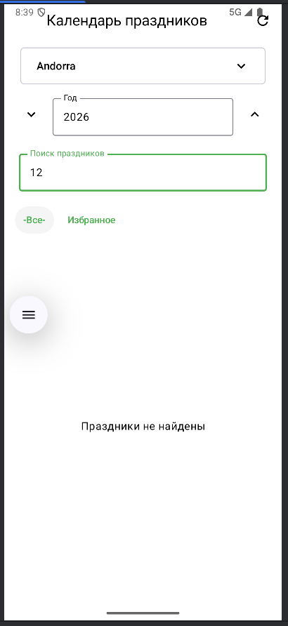
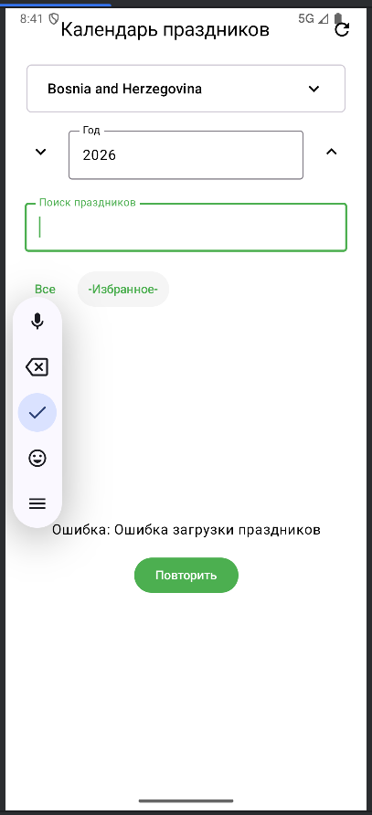
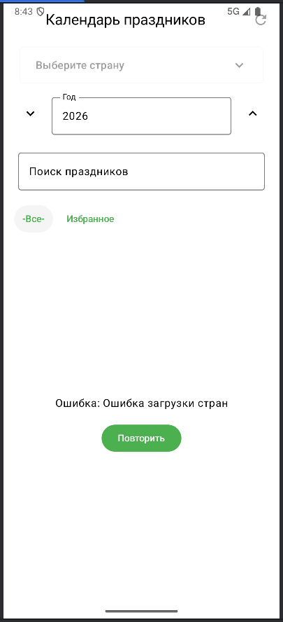

# Календарь праздников

## Информация о проекте
**ФИО:** Джафаров Руслан Элизбарович  
**Группа:** Б9123-09.03.03пикд группа 3 подгруппа 5

## API
**Название:** Nager.Date Public Holiday API  
**Описание:** Бесплатный API для получения информации о государственных праздниках более чем 100 стран. API предоставляет данные о праздниках, включая даты, локальные и английские названия, типы праздников (государственные, банковские, школьные и т.д.), региональную информацию.

**Базовый URL:** `https://date.nager.at/api/v3/`

**Основные endpoints:**
- `GET /AvailableCountries` - список всех доступных стран
- `GET /PublicHolidays/{year}/{countryCode}` - список праздников для указанной страны и года

**Особенности:**
- Не требует API ключа
- Нет ограничений по количеству запросов (rate limit)
- Всегда актуальные данные

## Скриншоты

## Чеклист выполнения

### Обязательный функционал

- **List/Search экран** - список праздников с поиском и фильтрацией
- **Detail/{id} экран** - детали праздника по ID в route

#### B) Архитектура
- **UiState** - `HolidayUiState` с `HolidayListState` (Loading, Error, Empty, Success)
- **ViewModel** - `HolidayViewModel` с обработкой состояний
- **Stateless UI** - экраны получают состояние через параметры
- **Repository** - `HolidayRepository` между ViewModel и Retrofit

#### C) Coroutines + Retrofit
- **Retrofit** - все сетевые запросы через Retrofit
- **suspend функции** - все методы API являются suspend функциями
- **viewModelScope** - все корутины запускаются из viewModelScope
- **State + callbacks** - использование UiState и callback функций (onEvent)

#### D) UI состояния
- **Loading** - CircularProgressIndicator при загрузке
- **Error** - сообщение об ошибке + кнопка Retry
- **Empty** - сообщение когда ничего не найдено
- **Success** - список праздников в LazyColumn

#### E) Избранное
- **Локальное хранение** - избранное хранится в ViewModel state (Set<String>)
- **Добавление/удаление** - можно добавлять и убирать праздники из избранного

### Бонусы
- **Debounce поиска** - поиск с задержкой 400ms через Job + delay, с отменой предыдущего запроса
- **Кнопка Refresh** - кнопка обновления данных в TopAppBar
- **Кэш последнего результата** - кэширование последнего результата в памяти (cachedHolidays)
- **Логирование запросов** - OkHttp logging interceptor с уровнем BODY
- **Перевод типов праздников** - типы праздников переведены на русский язык

### Особенности реализации
- Все сетевые запросы выполняются в корутинах через `viewModelScope`
- Состояния UI обрабатываются через sealed class `HolidayListState`
- Избранное хранится в `Set<String>` в состоянии ViewModel
- Поиск использует debounce
- Кэширование результатов в памяти для быстрого переключения фильтров
- Типы праздников автоматически переводятся на русский язык через extension-функцию в модели Holiday
