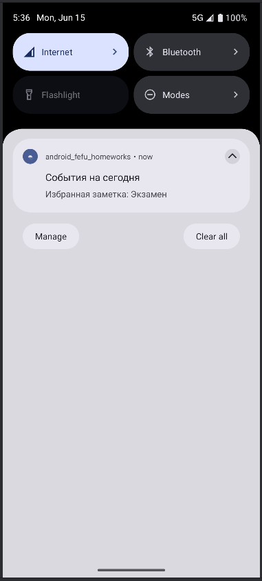
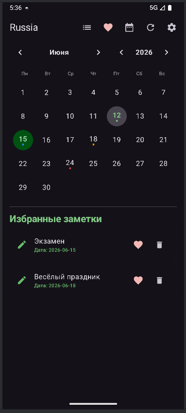
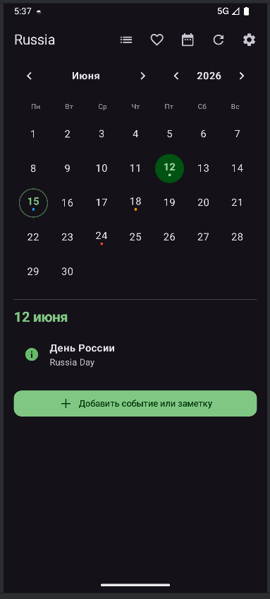

**ФИО:** Джафаров Руслан Элизбарович  
**Группа:** Б9123-09.03.03пикд группа 3 подгруппа 5  
**Ветка:** `HW7-Final-Project`  
**Приложение:** «Мой Календарь» — персональный календарь заметок с праздниками

## Что добавлено в финальной работе

### Новые экраны
- **Настройки** — тема оформления и выбор страны для праздников
- **История заметок** — список всех пользовательских заметок с переходом к дате в календаре
- **Экран заметки** — создание и редактирование событий/заметок:
- Категории заметок (личное, работа, праздники, дедлайн) с доп функционалом
- Поддержка повторяющихся заметок (неделя / месяц / год)
- Чеклист внутри заметки с отметкой прямо из списка дня

### Расширение существующих экранов
- Календарь объединён с заметками: на каждый день видны праздники и личные события
- Фильтр «только избранные заметки»
- push-уведомления о событиях на сегодня

### Архитектура и данные
- **DataStore** — настройки (тема, страна)
- **Room** — заметки, кэш праздников и стран
- **WorkManager** + **HiltWorker** — ежедневные уведомления и фоновое обновление кэша

## Новые пользовательские данные

### DataStore (настройки и предпочтения)
`selected_country_code` — Код страны для загрузки праздников
`app_theme` — Тема: светлая / тёмная / системная 

### Room (пользовательские данные и кэш) (Предыдущая модель для поисковика упразднена)
`notes` — Личные заметки и события (избранное — поле `isFavourite`) 

`holiday_cache` — Кэш праздников по стране и году 

`countries` — Кэш списка стран 

### Модель заметки (`Note`)
- `text`, `description` — заголовок и описание
- `date` — дата события (`YYYY-MM-DD`)
- `isFavourite` — избранная заметка
- `category` — категория (личное, работа, праздники, дедлайн)
- `repeatMode` — режим повтора (нет / неделя / месяц / год)
- `checklist` — список пунктов с флагом выполнения

Пользовательские данные создаются и изменяются через UI, хранятся локально и влияют на отображение календаря и уведомлений.

## Новые пользовательские сценарии

### 1. Личные заметки и события
**Цепочка:** `NoteDetailScreen` → `HolidayViewModel` → `HolidayRepository` → `NoteDao` → Room

Пользователь может:
- создать заметку на выбранный день;
- задать категорию, описание, режим повтора и чеклист;
- отметить заметку избранной;
- видеть повторяющиеся заметки на соответствующих датах в календаре;
- отмечать пункты чеклиста из списка дня;
- удалить заметку.

**Результат:** персональный слой поверх праздников API — календарь отражает и внешние, и пользовательские события.

### 2. Настройки приложения
**Цепочка:** `SettingsScreen` → `SettingsViewModel` → `SettingsRepository` (DataStore) / `HolidayRepository`

Пользователь выбирает тему и страну. Изменения сохраняются и восстанавливаются после перезапуска. Смена страны автоматически перезагружает праздники для выбранного года.

### 3. История заметок
**Цепочка:** `NotesHistoryScreen` → `HolidayViewModel` → Room (заметки)

Экран показывает все заметки пользователя. По нажатию открывается соответствующая дата в календаре. Работает без сети.

### 4. Ежедневные уведомления (фоновый сценарий)
**Цепочка:** `DailyWorker` → `HolidayRepository` + `SettingsRepository` → `NotificationHelper`

Раз в сутки worker:
- собирает заметки **на сегодня** (избранные помечаются отдельно);
- пытается обновить кэш праздников (если есть сеть);
- читает праздники на сегодня из кэша;
- показывает сводное уведомление, если есть хотя бы одно событие (включая повторяющиеся заметки на сегодня).

---

## Offline-first:
- UI слой (ViewModel) наблюдает (observe) за кэшем Room с помощью Flow. Room содержит заметки (или другие данные).
- Когда необходимо обновить данные, ViewModel вызывает suspend-функцию refresh у Repository.
- Repository отправляет HTTP-запрос к Nager API.
- Полученные данные через insert сохраняются в Room (кэш).
- После обновления кэша Flow автоматически доставляет новые данные в ViewModel.

---

## Фоновая обработка и уведомления (WorkManager)

`HolidayApplication` — Hilt + WorkManager, планирование `DailyWorker` 
`DailyWorker` — `@HiltWorker` — сбор событий на сегодня 
`NotificationHelper` — Канал уведомлений и показ push 
`MainActivity` — Запрос `POST_NOTIFICATIONS` при первом запуске 

**`DailyWorker` выполняет:**
1. Чтение заметок на сегодня из Room.
2. Попытку обновить кэш праздников для выбранной страны.
3. Чтение праздников на сегодня из кэша.
4. Показ уведомления «События на сегодня» (если список не пуст).

### Как проверить уведомления (debug)

1. Запустить приложение в режиме **Debug** из Android Studio.
2. Разрешить уведомления в системном диалоге.
3. Создать заметку **на сегодня** (главный экран → «Сегодня» → «Добавить событие или заметку» → «Сохранить»).
4. Перезапустить приложение (Run).

В **debug-сборке** `HolidayApplication` дополнительно ставит разовую задачу `DebugDailyNotification`: `DailyWorker` запускается автоматически через **5 секунд** после старта без Background Task Inspector.

---

## Тесты

### 15 unit-тестов

**Предыдущие (9, часть доработана для `stateIn` / `WhileSubscribed`):**
- Корректный перевод типов праздников на русский язык — `HolidayTest`
- Успешное обновление списка стран из API с сохранением в Room — `HolidayRepositoryImplTest`
- Успешное обновление кэша праздников по стране и году — `HolidayRepositoryImplTest`
- Корректное включение фильтра «только избранные заметки» — `HolidayViewModelTest`
- Проверка `retry()` после ошибки загрузки праздников — `HolidayViewModelTest`
- Корректная синхронизация выбранной даты при смене месяца — `HolidayViewModelTest`
- Корректное состояние экрана, когда страна не выбрана — `HolidayViewModelTest`
- Корректное переключение пункта чеклиста в заметке — `HolidayViewModelTest`
- Сохранение новой заметки через репозиторий — `HolidayViewModelTest`

**Новые (6):**
- Переключение флага избранного у заметки — `HolidayViewModelTest`
- Удаление заметки из репозитория — `HolidayViewModelTest`
- Корректное срабатывание еженедельного повтора заметки — `NoteOccurrenceTest`
- Корректное срабатывание ежегодного повтора заметки — `NoteOccurrenceTest`
- Формирование текста уведомления с заметкой и праздником на сегодня — `DailyEventFormatterTest`
- Пустой список событий, если на дату нет заметок и праздников — `DailyEventFormatterTest`

### Интеграционные тесты
- Сохранение и чтение заметки через Room (`observeNotes()`) — `HolidayRepositoryRoomIntegrationTest`
- Переключение режима «только избранные заметки» на главном экране — `HolidayScreensUiTest`
- Отображение экрана деталей праздника — `HolidayScreensUiTest`

### Скриншоты

